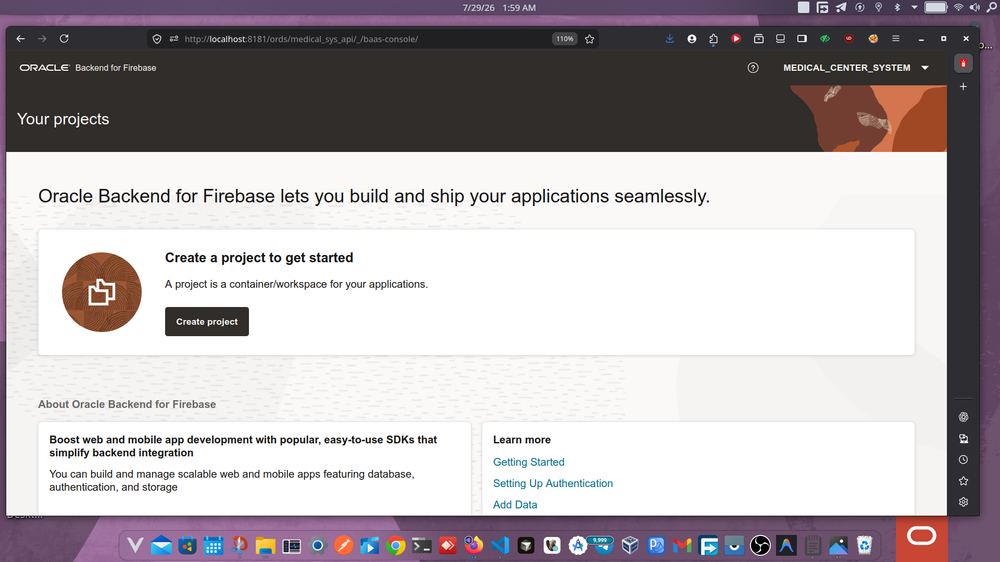
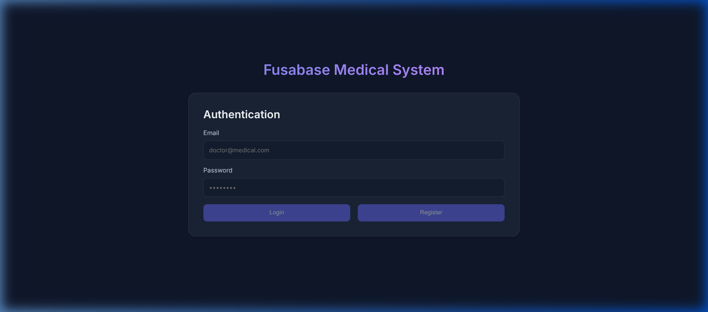
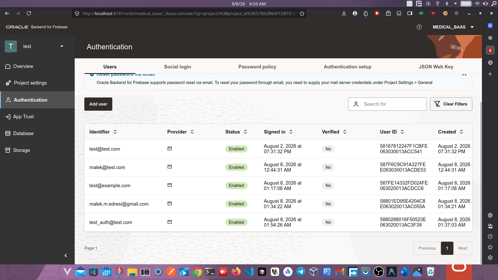
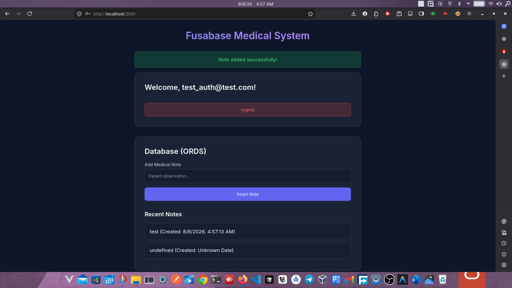
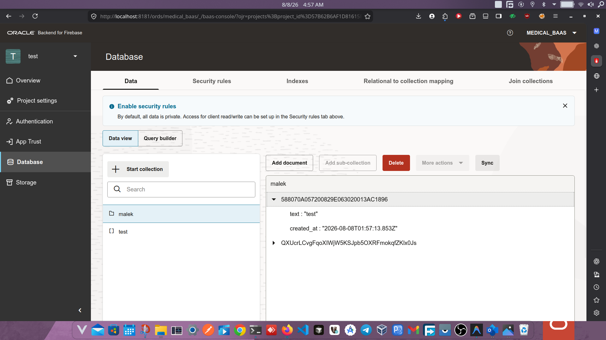
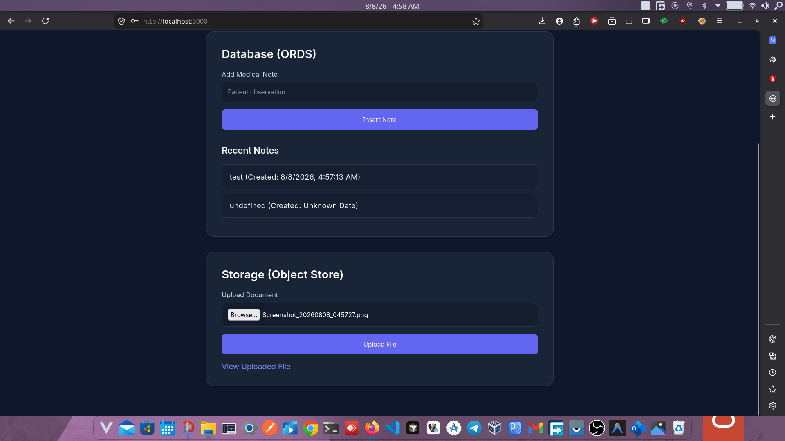
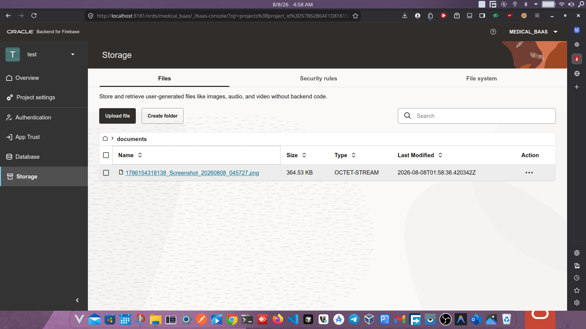

# Oracle Fusabase Web App Example

This is a complete, minimal, production-quality example project demonstrating how to use the **Oracle Backend for Firebase (Fusabase SDK)** in a modern web application. It connects to an Oracle Database via ORDS and provides standard Authentication, Database CRUD operations, and Object Storage.

## Visual Guide & Architecture

This project maps standard Firebase-like SDK calls directly to an Oracle Backend. Below is a visual walkthrough of the application and how the data is reflected in the Fusabase console.

### 1. Project Initialization
Before writing code, the project is configured inside the Oracle Backend for Firebase console.

*The BaaS console where the Oracle Fusabase project is created and managed.*

### 2. User Authentication
The application provides a secure login and registration system using `fusabase/auth`.
- **Frontend (Web App):** Users authenticate via the UI.
  
- **Backend (Fusabase Console):** User records are securely managed and tracked.
  

### 3. Database CRUD Operations (ORDS)
Users can add and retrieve records using `fusabase/oracledb`.
- **Frontend (Web App):** A user submits a medical note, triggering a success banner.
  
- **Backend (Fusabase Console):** The data is immediately persisted in the Oracle database collection.
  

### 4. Object Storage (DBFS)
Files uploaded through the UI are sent directly to the Oracle Database File System using `fusabase/storage`.
- **Frontend (Web App):** The user selects a file and uploads it.
  
- **Backend (Fusabase Console):** The file is safely stored and retrievable via the backend console.
  

## Features

- **User Authentication:** Register, login, and logout functionalities using `fusabase/auth`.
- **Database (ORDS):** Insert and retrieve medical notes using `fusabase/oracledb`.
- **Storage:** Upload and retrieve files to Oracle DBFS Object Store using `fusabase/storage`.
- **Clean UI:** Built with HTML, Vanilla JavaScript, and an elegant Glassmorphism CSS aesthetic.

## Tech Stack

- **Fusabase SDK** (`fusabase` npm package)
- **Vite** (for fast local development and bundling)
- **Vanilla JavaScript** (ES Modules)
- **HTML5 & CSS3**

## Project Structure

```bash
.
├── auth.js          # Authentication logic (login/register)
├── db.js            # Database operations (insert/fetch via ORDS)
├── config.js        # Fusabase initialization and configuration
├── index.html       # Main HTML layout and UI
├── main.js          # Entry point, UI interaction and orchestration
├── package.json     # Project dependencies
├── storage.js       # File upload/retrieval logic
├── style.css        # Premium glassmorphism UI styles
└── vite.config.js   # Vite development server configuration
```

## Setup & Installation

1. **Clone or download the project** to your local machine.

2. **Install Dependencies** (Vite + Fusabase SDK):
   ```bash
   npm install
   ```
   *(If you are installing manually in a new project, you can use: `npm install fusabase`)*

3. **Configure the SDK**:
   The configuration is embedded inside `config.js` and securely loads from environment variables:
   ```javascript
   const fusabaseConfig = {
     "schema": import.meta.env.VITE_FUSABASE_SCHEMA || "your_schema",
     "app_name": import.meta.env.VITE_FUSABASE_APP_NAME || "your_app_name",
     "app_type": "WEB",
     // ...
   };
   ```

## How to Run Locally

Run the development server using Vite:
```bash
npm run dev
```

Visit the local URL provided in your terminal (usually `http://localhost:3000` or `http://localhost:5173`) to view and interact with the application.

## Contribution & Maintenance

This repository acts as a foundation for Oracle ACEs, developers, and engineers seeking to bridge modern frontend tools with robust Oracle Backend architectures.

**Happy Coding!**
